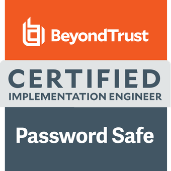
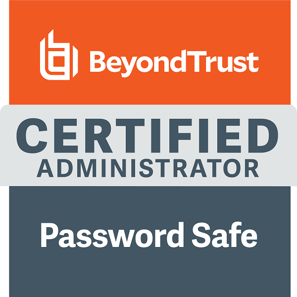
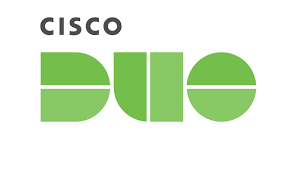
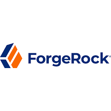
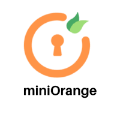
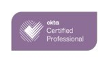
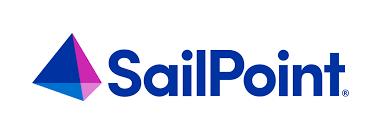

# Sagar D. Patil

---

## Contact Information

- 📍 **Pune, Maharashtra, India**  
- 📞 **+91-7276-303-146**  
- 📧 [sagarpatil00710@gmail.com](mailto:sagarpatil00710@gmail.com)  
- 🔗 [LinkedIn Profile](https://www.linkedin.com/in/sagarpatilpune)

---

## Profile

Seeking to expand my horizons into the ocean of Information Security with a deep focus on Identity lifecycle and governance, Role-based access control (RBAC), Federation technologies (SAML, OAuth, OIDC), Single Sign-On (SSO), Multifactor Authentication (MFA), Security Compliance, and Advisory. A dynamic, hardworking, proactive, and efficient leader with strong teamwork ethic and multitasking skills.

---

## Skills

- Identity lifecycle and governance: Segregation of Duties (SOD), Role-Based Access Control (RBAC), and Provisioning-Reconciliation.
- MFA and SSO (Single Sign-On)
- Access Management
- SAML and OIDC federation
- MS Active Directory and LDAP
- Microsoft Entra ID (Azure Active Directory)
- Networking (OSI model) and Public Key Infrastructure
- Firewall and Network Security
- Linux
- MySQL
- Scripting: Java (beginner)
- **Technologies known**: Okta, Cisco Duo, ForgeRock Open AM, CIAM, SailPoint IIQ, Swivel Secure, OneLogin, BeyondTrust, MiniOrange, Sectona.

---

## Experience

| **Serial No.** | **Title**                    | **Company**                        | **Location**  | **Duration**                  | **Key Responsibilities**                                                                                             |
|----------------|------------------------------|------------------------------------|---------------|-------------------------------|----------------------------------------------------------------------------------------------------------------------|
| 1.             | Senior IAM Engineer           | Wipro Limited                      | Pune, India   | November 2024 – Present        | - Serving as a **SailPoint IIQ Implementation Engineer**. - Responsible for **migration from Oracle Identity Manager (OIM) to SailPoint IIQ**. - Leading the implementation and configuration of SailPoint IIQ. - **Managing IAM solutions for BFSI sector projects**. - Collaborating with cross-functional teams to ensure seamless deployment. |
| 2.             | Senior Security Engineer      | Inspira Enterprise                 | Pune, India   | February 2022 – November 2024  | - Implemented IAM solutions for telecommunications and transportation sectors in the Middle East. - Led **Okta SSO/MFA** for the energy sector in Australia and **SailPoint IIQ** for the **BFSI sector** in the Middle East. - Led R&D and practice building on 3 IAM technologies. - Trained and mentored new team members. - Interviewed candidates for IAM roles. |
| 3.             | Software Security Trainee     | Algebra Security Solutions (Merged into Inspira Enterprises) | Pune, India   | December 2021 – February 2022  | - Gained knowledge of network security, information security, and Okta Access Management solutions.                     |
| 4.             | Electronics Engineer (Design Dept.) | Electronics India                  | Pune, India   | July 2018 – August 2021       | - Edited Gerber files, optimized PCB panels for production, and created CNC drilling programs for efficient manufacturing. |
| 5.             | Electronic Engineer (CAD-CAM Dept.) | Shogini Technoarts Pvt. Ltd.       | Pune, India   | December 2017 – May 2018      | - Worked on single-side and double-side PCBs, editing Gerber files for production suitability.                        |
| 6.             | Electronic Engineer (CAD-CAM Dept.) | Softind Solutions LLP              | Pune, India   | January 2017 – October 2017   | - Worked on single-side and double-side PCBs, editing Gerber files for production compatibility.                      |

---

## Education

**B.E. (Electronics & Telecommunication)**  
Savitribai Phule Pune University, India – June 2016

---

## Certifications/Technical Accreditations
## Certifications and Technical Accreditations

| **Serial No.** | **Title**                                     | **Certification Provider** | **Month and Year of Completion** |
|----------------|-----------------------------------------------|----------------------------|----------------------------------|
| 1.             | Privileged Remote Access Administrator        | BeyondTrust                | February 2025                   |
| 2.             | SailPoint Identity Security Leader            | SailPoint                  | February 2025                   |
| 3.             | Endpoint Privilege Management - Windows Administrator | BeyondTrust            | January 2025                    |
| 4.             | SailPoint IIQ Certified Associate             | SailPoint                  | December 2024                   |
| 5.             | Password Safe Administrator                   | BeyondTrust                | December 2024                   |
| 6.             | Certified Implementation Engineer (Password Safe) | BeyondTrust              | November 2024                   |
| 7.             | Password Safe Administrator                   | BeyondTrust                | September 2024                  |
| 8.             | SailPoint IIQ Developer                       | Inspira (Internal assessment) | March 2024                    |
| 9.             | Certified L1 Administrator                    | Cisco Duo Security         | February 2024                   |
| 10.            | Sectona Implementation Engineer               | Sectona                    | July 2023                       |
| 11.            | Okta Certified Professional                   | Okta                       | September 2022                  |
| 12.            | AWS Certified Solutions Architect - Associate | AWS                        | July 2022                       |
| 13.            | Swivel Secure Access Manager                  | Swivel Secure              | May 2022                        |
| 14.            | Certified Ethical Hacker (V11)                | EC – Council               | December 2021                   |

---

## Languages

- English  
- Hindi  
- Marathi  
- Kannada  

---

## Milestones / Achievements

- Won 2nd Place in Inspira Indoor Chess Competition  

---

## Badges

  
  
  
  
  
  
  
  
  

---

## Download My Portfolio

You can download my portfolio as a PDF by clicking the link below:  
[Download Portfolio](assets/downloads/Portfolio.pdf)
