# Sagar D. Patil

---

## Contact Information

- 📍 **Pune, Maharashtra, India**  
- 📞 **+91-7276-303-146**  
- 📧 [sagarpatil00710@gmail.com](mailto:sagarpatil00710@gmail.com)  
- 🔗 [LinkedIn Profile](https://www.linkedin.com/in/sagarpatilpune)

---

## 🔹 Professional Summary

IAM Engineer with **4+ years of hands-on experience** in **Identity and Access Management**, specializing in **SailPoint IdentityIQ (IIQ)** implementations and enterprise identity governance. Strong expertise in **application onboarding, Joiner–Mover–Leaver (JML) lifecycle automation, access certifications**, and **compliance-driven IAM controls (NIST, SoD)**.

Experienced in **SSO/MFA solutions (Okta, Cisco Duo)**, federation protocols (**SAML, OAuth, OIDC**), and **Active Directory integrations**, with successful delivery across **BFSI and large enterprise environments**.

---
## 🔹 Core Competencies

- **SailPoint IIQ:** Application onboarding, JML lifecycle, access certifications, RBAC, SoD  
- **IAM / IGA / PAM:** Enterprise-scale identity governance and privileged access management  
- **SSO & MFA:** Okta, Cisco Duo, OneLogin (SAML, OAuth, OIDC)  
- **PAM:** BeyondTrust (Password Safe, PRA, EPM), Sectona  
- **Directories & Platforms:** Microsoft Entra ID (Azure AD), Active Directory, Linux, AWS, OCI  

---
## 🔹 Technical Skills

### Identity Governance & IAM
- Joiner–Mover–Leaver (JML) lifecycle automation  
- Application onboarding (AD, JDBC, Delimited files)  
- Access certifications & manager campaigns  
- Role-Based Access Control (RBAC)  
- Segregation of Duties (SoD)  
- Provisioning, aggregation & reconciliation  
- Custom rules, workflows & reports (SailPoint IIQ)

### Authentication & Federation
- SAML 2.0, OAuth 2.0, OpenID Connect (OIDC)  
- Single Sign-On (SSO) & Multi-Factor Authentication (MFA)  
- LDAP, Kerberos
  
### Directories & Infrastructure
- Microsoft Active Directory  
- Microsoft Entra ID (Azure AD)  
- Public Key Infrastructure (PKI)

### Cloud & Platforms
- AWS  
- Oracle Cloud Infrastructure (OCI)  
- Microsoft Azure  

### Security & Systems
- Networking fundamentals (OSI model)  
- Firewall & network security basics  
- Linux administration  
- MySQL  

### Scripting & Automation
- Java (Beginner – rules, logic, customization)

### Technologies known
SailPoint IIQ, SailPoint ISC, Okta, Cisco Duo, ForgeRock Open AM,Saviyant, Swivel Secure, OneLogin, BeyondTrust, MiniOrange, Sectona.

---

## 🔹 Professional Experience

### **Senior IAM Engineer – Wipro Limited**  
📍 Pune, India | **Nov 2024 – Present**
- Led **end-to-end application onboarding** in SailPoint IIQ including entitlement mapping and custom rules  
- Designed **NIST-aligned manager certification campaigns** for 15+ applications with automated remediation  
- Conducted requirement-gathering with application owners and stakeholders  
- Provided **Tier 2/3 production support**, achieving 95%+ first-call resolution  
- Monitored environment health, workflows, and task schedules ensuring **99.5% uptime**  
- Reduced manual provisioning effort by **40%** through process automation  

---

### **Senior Security Engineer (IAM Specialist) – Inspira Enterprise**  
📍 Pune, India | **Feb 2022 – Nov 2024**

#### **SailPoint IIQ Implementation – BFSI Client (Middle East)**
- Deployed **SailPoint IIQ 8.3** across Dev, UAT, and Prod for **5,000+ users**  
- Implemented automated **JML lifecycle workflows**, reducing manual provisioning by **70%**  
- Onboarded AD, JDBC, and file-based applications with custom correlation logic  
- Developed custom rules for provisioning, account correlation, and policy enforcement  
- Performed root-cause analysis and implemented permanent fixes  

#### **Okta SSO/MFA Implementation – Energy Sector Client (Australia)**
- Administered Okta SSO/MFA for **20+ enterprise applications**  
- Implemented SAML integrations (Salesforce, Jira, Office 365, VPNs)  
- Reduced unauthorized access incidents by **85%** via MFA policies  
- Integrated Active Directory with HA agents achieving **99.9% uptime**  

#### **Additional Contributions**
- Led IAM PoCs for **OneLogin, MiniOrange, Cisco Duo**  
- Mentored **5+ junior engineers** on IAM fundamentals  
- Conducted technical interviews for IAM roles  

---

### **Software Security Trainee – Algebra Security Solutions**  
📍 Pune, India | **Dec 2021 – Feb 2022**
- Hands-on training in IAM fundamentals, Okta administration, and SSO  
- Exposure to access control models and security best practices  

---

### **Earlier Engineering Experience (2017 – 2021)**
**Electronics Engineer – PCB Design & Manufacturing**
- PCB design optimization and CNC workflow automation
- Improved manufacturing efficiency by 25%
  
---

## 🔹 Certifications

### IAM / Identity Governance
- **Microsoft Identity & Access Administrator (SC-300)** – Jan 2026  
- **SailPoint Identity Security Professional** – Dec 2025  
- **Saviynt Identity Security for AI Age (ISAA)** – Oct 2025  
- **SailPoint Identity Security Leader** – Feb 2025  
- **SailPoint IIQ Certified Associate** – Dec 2024  

### Privileged Access Management (PAM)
- **BeyondTrust Privileged Remote Access Administrator** – Feb 2025  
- **BeyondTrust Endpoint Privilege Management (Windows)** – Jan 2025  
- **BeyondTrust Certified Implementation Engineer (Password Safe)** – Nov 2024  
- **BeyondTrust Password Safe Administrator** – Sep 2024  
- **BeyondTrust AD Bridge Administrator** – Dec 2024  
- **Sectona Implementation Engineer** – Jul 2023  
- **Cisco Duo Certified L1 Administrator** – Feb 2024  

### Cloud & Access Platforms
- **OCI Architect Associate** – Oct 2025  
- **OCI Foundations Associate** – Sep 2025  
- **AWS Solutions Architect – Associate** – Jul 2022  
- **Azure Active Directory Masterclass** – Mar 2024  
- **Okta Certified Professional** – Sep 2022  
- **Swivel Secure Access Manager** – May 2022  

### Security
- **Certified Ethical Hacker (CEH v11)** – Dec 2021  

---

## 🔹 Achievements
- Appreciation Certificate from **Wipro** for IAM project excellence  
- **2nd Place** – Inspira Enterprise Indoor Chess Competition  

---

## 🔹 Education

**Bachelor of Engineering (B.E.) – Electronics & Telecommunication**  
Savitribai Phule Pune University, India  
🎓 Graduated: **June 2016**

---

## 🔹 Languages

- English  
- Hindi  
- Marathi  
- Kannada  

---

## Badges

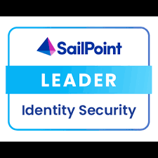
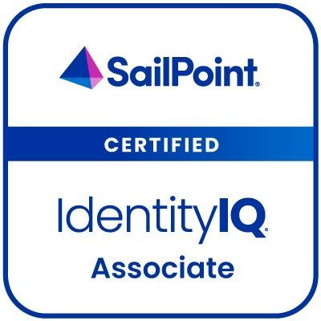
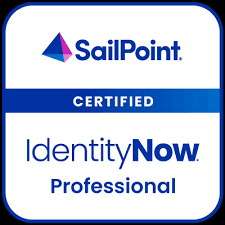
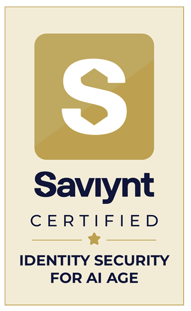

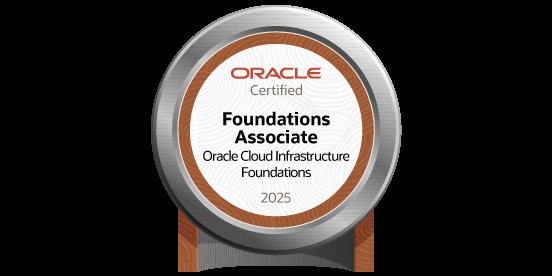
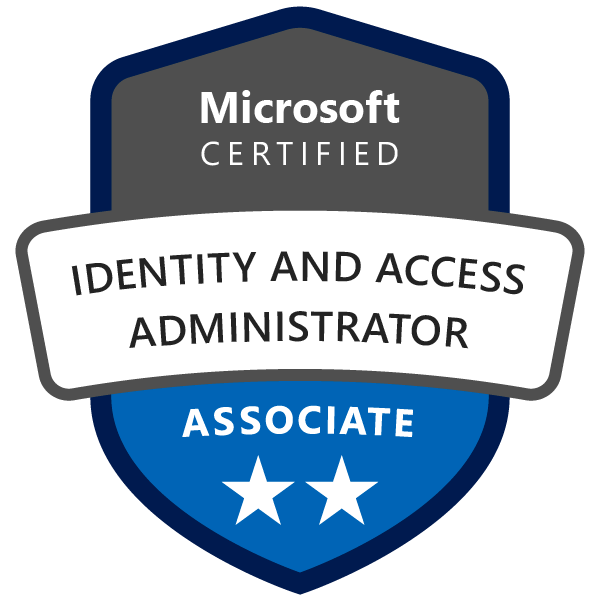
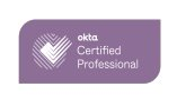

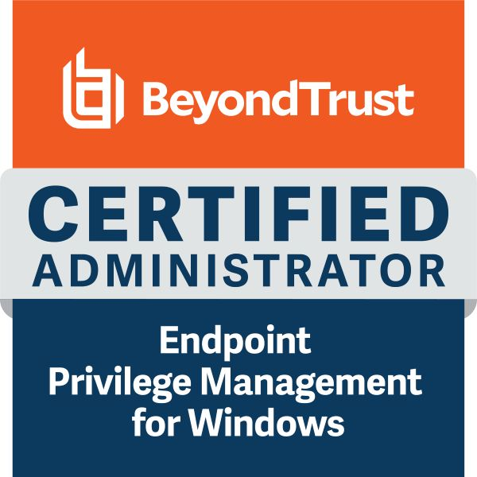
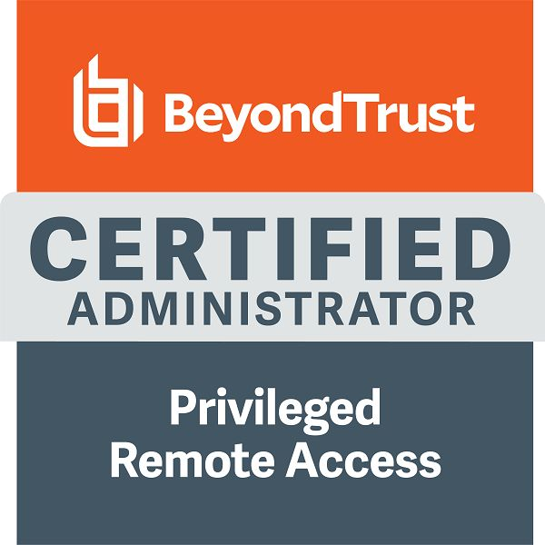
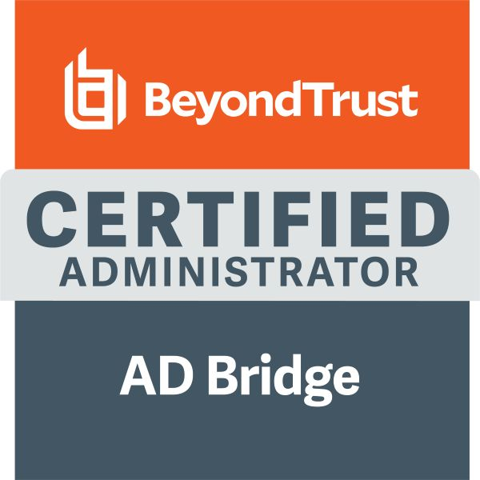
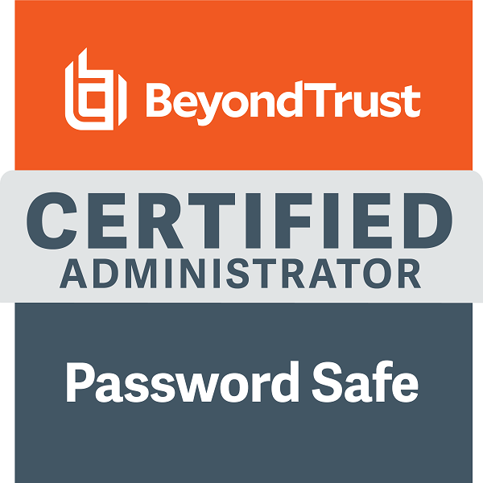
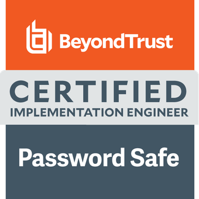

---

## Download My Portfolio

You can download my portfolio as a PDF by clicking the link below:  
[Download Portfolio](assets/downloads/Portfolio.pdf)
