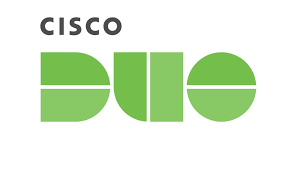
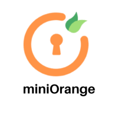

# Sagar D. Patil

---

## Contact Information

- 📍 **Pune, Maharashtra, India**  
- 📞 **+91-7276-303-146**  
- 📧 [sagarpatil00710@gmail.com](mailto:sagarpatil00710@gmail.com)  
- 🔗 [LinkedIn Profile](https://www.linkedin.com/in/sagarpatilpune)

---

## Profile

Identity & Access Management (IAM) professional with 8.5+ years of engineering experience, including 4+ years dedicated to IAM, PAM, and IGA solutions across BFSI and enterprise environments. Skilled in designing secure, scalable identity frameworks, managing access governance, and enabling compliance across cloud, hybrid, and on-premise infrastructures.

---
## Core Competencies:

- SailPoint IIQ – End-to-end application onboarding, JML lifecycle automation, access certifications, RBAC, SoD, custom rules, and policy enforcement

- IAM / PAM / IGA – Enterprise-scale identity governance, privileged access management, workflow automation, and compliance enablement

- SSO & MFA – Implementation and administration using Okta, Cisco Duo, OneLogin; expertise in SAML, OAuth, and OIDC integrations

- PAM Solutions – BeyondTrust (Password Safe, PRA, EPM), Sectona; password vaulting, session management, and privileged account security

- Directories & Platforms – Microsoft Entra ID (Azure AD), Active Directory, Linux, AWS, OCI; hybrid and cloud identity management

- Compliance & Security Frameworks – NIST-aligned certification campaigns, Zero Trust, regulatory adherence, and IAM risk mitigation

- Mentorship & Leadership – Guiding junior engineers, conducting PoCs, and building IAM practice across multiple enterprise projects

---
## Skills

- Identity lifecycle and governance: Segregation of Duties (SOD), Role-Based Access Control (RBAC), and Provisioning-Reconciliation.
- MFA & SSO: Single Sign-On, Authentication Policies
- Access Management & Federation: LDAP, Kerberos, SAML, OIDC
- Cloud & Infrastructure: AWS, OCI, Microsoft Azure, PKI
- Networking & Security: OSI model, firewall, VPNs, network security basics
- Linux & Database: Linux administration, MySQL
- Scripting & Automation: Java, Custom Rules & Workflows in SailPoint IIQ
- Firewall and Network Security
- Linux
- MySQL
- Scripting: Java (beginner)
- **Technologies known**: Okta, Cisco Duo, ForgeRock Open AM, SailPoint ISC, SailPoint IIQ, Saviyant, Swivel Secure, OneLogin, BeyondTrust, MiniOrange, Sectona.

---

## **Experience**

| **Serial No.** | **Role & Organization**                                             | **Duration**                   | **Key Responsibilities**                                                                                                     |
|----------------|---------------------------------------------------------------------|---------------------------------|------------------------------------------------------------------------------------------------------------------------------|
| **1.**         | Senior IAM Engineer, Wipro Limited, Pune, India                     | November 2024 – Present         | - Lead SailPoint IIQ implementation.  - Migration from OIM to IIQ.  - Managing IAM solutions for BFSI projects.  - Cross-functional team collaboration. |
| **2.**         | Senior Security Engineer, Inspira Enterprise, Pune, India          | February 2022 – November 2024   | - Implemented IAM solutions for telecommunications and transportation sectors in the Middle East.  - Leading Okta SSO/MFA for the energy sector in Australia and SailPoint IIQ for BFSI sector in the Middle East.  - Led R&D and practice building on 3 IAM technologies.  - Trained and mentored new team members.  - Interviewed candidates for IAM roles. |
| **3.**         | Software Security Trainee, Algebra Security Solutions (Merged into Inspira Enterprises), Pune, India | December 2021 – February 2022   | - Gained knowledge of network security, information security, and Okta Access Management solutions.                           |
| **4.**         | Electronics Engineer (Design Dept.), Electronics India, Pune, India | July 2018 – August 2021         | - Edited Gerber files and optimized PCB panels.  - Created CNC drilling programs.                                        |
| **5.**         | Electronic Engineer (CAD-CAM Dept.), Shogini Technoarts Pvt. Ltd., Pune, India | December 2017 – May 2018        | - Worked on single and double-side PCBs.  - Edited Gerber files for production.                                          |
| **6.**         | Electronic Engineer (CAD-CAM Dept.), Softind Solutions LLP, Pune, India | January 2017 – October 2017     | - Worked on single and double-side PCBs.  - Edited Gerber files for production compatibility.                              |
                          

---

## Education

**B.E. (Electronics & Telecommunication)**  
Savitribai Phule Pune University, India – June 2016

---

## Certifications/Technical Accreditations
## Certifications and Technical Accreditations

| **Serial No.** | **Title**                                     | **Certification Provider** | **Month and Year of Completion** |
|----------------|-----------------------------------------------|----------------------------|----------------------------------|
| 1.             | Privileged Remote Access Administrator        | BeyondTrust                | February 2025                   |
| 2.             | SailPoint Identity Security Leader            | SailPoint                  | February 2025                   |
| 3.             | Endpoint Privilege Management - Windows Administrator | BeyondTrust            | January 2025                    |
| 4.             | SailPoint IIQ Certified Associate             | SailPoint                  | December 2024                   |
| 5.             | AD Bridge Administrator                       | BeyondTrust                | December 2024                   |
| 6.             | Certified Implementation Engineer (Password Safe) | BeyondTrust              | November 2024                   |
| 7.             | Password Safe Administrator                   | BeyondTrust                | September 2024                  |
| 8.             | SailPoint IIQ Developer                       | Inspira (Internal assessment) | March 2024                    |
| 9.             | Certified L1 Administrator                    | Cisco Duo Security         | February 2024                   |
| 10.            | Sectona Implementation Engineer               | Sectona                    | July 2023                       |
| 11.            | Okta Certified Professional                   | Okta                       | September 2022                  |
| 12.            | AWS Certified Solutions Architect - Associate | AWS                        | July 2022                       |
| 13.            | Swivel Secure Access Manager                  | Swivel Secure              | May 2022                        |
| 14.            | Certified Ethical Hacker (V11)                | EC – Council               | December 2021                   |

---

## Languages

- English  
- Hindi  
- Marathi  
- Kannada  

---

## Milestones / Achievements

- Won 2nd Place in Inspira Indoor Chess Competition  

---

## Badges

  
  
  
  
  
  
  
  
  
  
  
  
  

---

## Download My Portfolio

You can download my portfolio as a PDF by clicking the link below:  
[Download Portfolio](assets/downloads/Portfolio.pdf)
